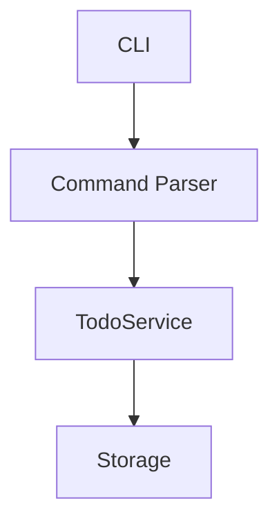

# CLAUDE.md

## CRITICAL: Always Use Workflow First

**When the user asks you to build, create, implement, or fix anything, you MUST immediately call `workflow_init(task)` as your FIRST action.**

Do NOT:
- Ask clarifying questions first
- Ask what kind of feature they want
- Wait for the user to explicitly say `/workflow-start`

Do THIS:
1. User says "Create a todo app" → Immediately call `workflow_init("Create a todo app")`
2. User says "Fix the login bug" → Immediately call `workflow_init("Fix the login bug")`
3. User says "Add dark mode" → Immediately call `workflow_init("Add dark mode")`

The workflow system handles planning and requirements gathering. Start the workflow FIRST, then explore and plan during the plan step.

---

## Dynamic Workflow System

This project uses a configurable workflow system for structured task management. Workflows are defined in YAML and support approval gates for human checkpoints.

**To start a workflow, use `/workflow-start <task>`**

### Workflow Configuration

Workflows are defined in `workflow.yaml`:

```yaml
name: default
description: Standard development workflow

steps:
  - name: plan
    needs_approval: true
    allows_iteration: true
    approval_prompt: "Review the plan..."
    instructions: |
      Explore the codebase and design your approach...
```

### Available Tools

- `workflow_init(task)` - Initialize workflow, returns first step instructions
- `workflow_status()` - Get current state, progress, artifacts, and instructions
- `workflow_next()` - Request to proceed. If step requires approval, sets `awaiting_approval` status
- `workflow_approve()` - Approve current step and move to next (only when `awaiting_approval`)
- `workflow_iterate(feedback)` - Provide feedback and iterate on current step
- `workflow_set_artifact(type, content)` - Store any artifact (plan, criteria, test_results, etc.)
- `workflow_set_plan(plan)` - Store the implementation plan (shorthand for set_artifact)
- `workflow_set_criteria(criteria[])` - Set verification criteria (shorthand for set_artifact)
- `workflow_set_pr(pr_number, pr_url)` - Set PR number for tracking in review step
- `workflow_check_pr(comment_count)` - Check for new PR comments, returns suggested action
- `workflow_step(step, status)` - Update a specific step's status
- `workflow_blocked(reason)` - Mark as blocked by external dependency

### Available Commands

- `/workflow-start <task>` - Initialize workflow
- `/workflow-status` - Show current progress
- `/workflow-next` - Move to next step (or request approval)
- `/workflow-approve` - Approve current step and proceed
- `/workflow-iterate <feedback>` - Provide feedback and iterate
- `/workflow-blocked <reason>` - Mark as blocked

### Default Workflow Steps

1. **plan** (requires approval, allows iteration) - Explore codebase, design approach
2. **criteria** (requires approval, allows iteration) - Define completion criteria
3. **execute** (allows iteration) - Implement changes
4. **verify** (allows iteration) - Run tests, check all criteria pass
5. **pr** - Create pull request, track with `workflow_set_pr()`
6. **review** (requires approval, allows iteration) - Monitor PR comments, address feedback
7. **complete** - Summarize accomplishments

### Approval Flow

**CRITICAL: Steps with `requires_approval: true` require human approval before proceeding.**

The approval flow works as follows:

1. You work on a step (e.g., create a plan with diagrams)
2. When done, call `workflow_next()` - this sets status to `awaiting_approval`
3. **STOP AND WAIT** - Do NOT proceed until user responds
4. User reviews and responds - detect their intent:
   - **Approval signals** → call `workflow_approve()`:
     - "looks good", "approved", "lgtm", "go ahead", "proceed", "yes", "ok", "ship it"
   - **Iteration signals** → call `workflow_iterate(feedback)`:
     - Any feedback, questions, or change requests
   - **Explicit commands** (also work):
     - `/workflow-approve` - Approved
     - `/workflow-iterate <feedback>` - Iterate with feedback
5. If iterating, revise your work and call `workflow_next()` again
6. Repeat until approved

**DO NOT auto-proceed through approval gates. Always wait for user response.**

### Plan Step Instructions

When in the **plan** step:

1. Explore the codebase thoroughly using available tools
2. Design your implementation approach
3. **Include Mermaid diagrams** to visualize:
   - System architecture
   - Data flow
   - Component relationships
   - Before/after states
4. Present the complete plan to the user in a clear, structured format
5. **Call `workflow_set_plan(plan)` to store the COMPLETE plan** - save the full plan with all diagrams, options, details, and explanations. Do NOT summarize. But do NOT include exploration noise (tool outputs, file listings, grep results, "Running: find..." etc). Only the clean, presentable plan content.
6. Call `workflow_next()` to request approval
7. **STOP AND WAIT** for the user to respond with either:
   - `/workflow-approve` - Proceed to criteria step
   - `/workflow-iterate <feedback>` - Revise the plan based on feedback
8. If user provides iteration feedback, revise the plan, update with `workflow_set_plan()` (full plan again), and repeat

**DO NOT proceed to the criteria step until the user explicitly approves the plan.**

**IMPORTANT: The plan saved via `workflow_set_plan()` must be the COMPLETE plan, not a summary. External apps display this plan to users. Include all details, diagrams, options, and explanations - but exclude exploration noise (tool outputs, file listings, command results). Just the clean plan.**

### Plan Formatting

Plans should be **well-structured markdown** that's easy to read:

````markdown
## Implementation Plan

### Overview
Brief summary of what we're building and the approach.

### Architecture


### Key Components
1. **Component A** - What it does
2. **Component B** - What it does

### Files to Create/Modify
- `path/to/file.ts` - Description
- `path/to/other.ts` - Description

### Approach
Step-by-step implementation order.
````

**Guidelines:**
- Use **headers** to organize sections
- Use **Mermaid diagrams** for architecture/flow visualization
- Keep it **scannable** - bullets and short paragraphs
- **No tool output** - no "Running: find...", grep results, etc.

### Criteria Step Instructions

When in the **criteria** step:

1. Based on the approved plan, define **high-level acceptance criteria**
2. Keep to **5-8 items max** - each a meaningful check, not a test case
3. Use `workflow_set_criteria()` to record the criteria
4. Present criteria to the user for review
5. Call `workflow_next()` to request approval
6. **STOP AND WAIT** for user approval or iteration feedback

**DO NOT proceed to execute until the user explicitly approves the criteria.**

### PR Step Instructions

When in the **pr** step:

1. Create a descriptive pull request using `gh pr create`
2. Extract the PR number from the output
3. Call `workflow_set_pr(pr_number, pr_url)` to track the PR
4. Call `workflow_next()` to move to the review step

### Review Step Instructions

When in the **review** step:

1. Run `gh pr view <pr_number> --comments --json comments` to get comments
2. Count the comments and call `workflow_check_pr(comment_count)`
3. Based on the `action` returned:
   - `"address_comments"` - Read and address the new comments, then check again
   - `"wait"` - Wait the suggested seconds, then check again
   - `"ready_for_approval"` - No new comments for 1+ minute, call `workflow_next()`
4. After calling `workflow_next()`, **STOP AND WAIT** for user approval

**The review step polls for PR comments. If no new comments for 1 minute, it's ready for approval.**

### Verification Criteria Format

Criteria should be **high-level acceptance checks** formatted as a **markdown checklist**:

**GOOD** (high-level checklist with checkboxes):
```
workflow_set_criteria([
  "- [ ] All CRUD operations work correctly",
  "- [ ] Invalid inputs show appropriate errors",
  "- [ ] Help/usage displays when needed",
  "- [ ] No crashes or unhandled exceptions",
  "- [ ] Documentation covers all features"
])
```

**BAD** (too granular - reads like unit tests):
```
workflow_set_criteria([
  "- [ ] node app.js add 'Task' creates task",
  "- [ ] node app.js add '' shows error",
  "- [ ] node app.js list shows tasks",
  "- [ ] node app.js done 1 marks complete",
  // ... 10+ more detailed cases
])
```

**During verify step**, mark items complete as you verify them:
```
workflow_set_criteria([
  "- [x] All CRUD operations work correctly",
  "- [x] Invalid inputs show appropriate errors",
  "- [ ] Help/usage displays when needed",  // in progress
  "- [ ] No crashes or unhandled exceptions",
  "- [ ] Documentation covers all features"
])
```

**Guidelines:**
- **5-8 items max** - group related checks
- **Use `- [ ]` format** - renders as checkboxes
- **Mark `- [x]` when verified** - shows progress
- **Acceptance-level** - "feature works" not "specific command works"

### Event Output

Tools emit structured events for external systems:

```json
{"event": "workflow", "type": "awaiting_approval", "step": "plan", "approval_prompt": "...", "can_iterate": true}
```

```json
{"event": "workflow", "type": "approved", "step": "plan", "next_step": "criteria"}
```

```json
{"event": "workflow", "type": "iteration", "step": "plan", "message": "feedback here"}
```

Event types: `init`, `step_update`, `step_complete`, `awaiting_approval`, `approved`, `iteration`, `blocked`, `artifact_set`, `pr_set`, `pr_check`

### State Persistence

State is saved to `~/state/workflow_state.json`. After context compaction, call `workflow_status()` to restore awareness.

State includes:
- `artifacts` - Map of stored artifacts (plan, criteria, pr, test_results, etc.)
- `iteration_count` - How many times current step has been iterated
- `iteration_feedback` - Array of all feedback received on current step
- `waiting_for_approval` - Whether step is awaiting approval
- `pr_number`, `last_comment_check`, `last_comment_count` - PR tracking for review step

### Summary Artifact

**Keep a short status summary** using `workflow_set_artifact("summary", ...)`:

```
• Goal: Build a CLI todo app with add/list/done/remove commands
• Progress: Executing implementation (step 3/7)
• Last: Defined 5 verification criteria
```

Just 3 bullet points:
- **Goal** - Original task (one line)
- **Progress** - Current step and position
- **Last** - What was just completed

**Update at each step transition.** Keep it brief - this is a status line, not a detailed log.

### Best Practices

1. Always start tasks with `/workflow-start`
2. **Include Mermaid diagrams** in plans for architecture/flow
3. Set verification criteria during planning
4. **Update summary artifact** at each step transition
5. **STOP AND WAIT** at approval gates - never auto-proceed
6. Use `workflow_blocked` only for external dependencies (not approval gates)
7. Verify all criteria before creating PR
8. Emit structured events for external parsing
